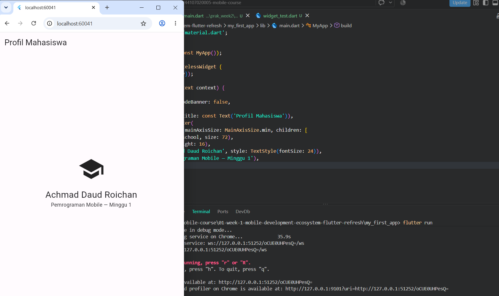
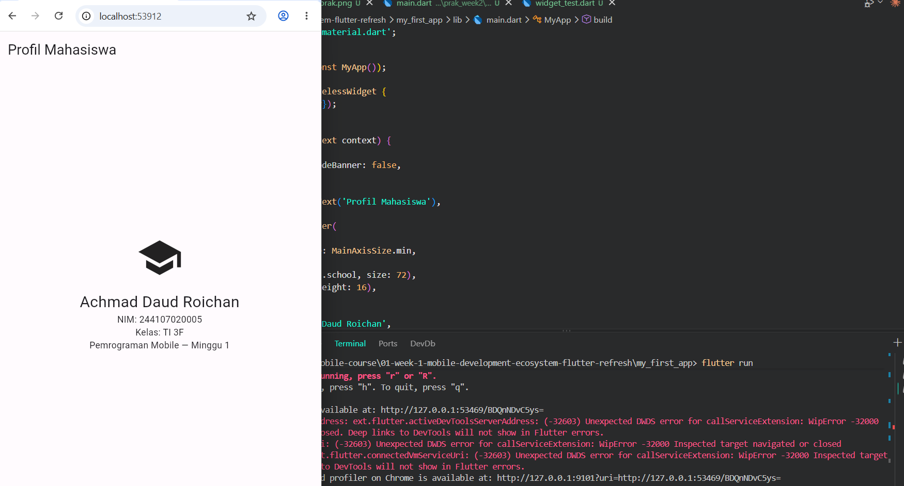

# Laporan Praktikum Week 1

## Mobile Development Ecosystem & Flutter Refresh

**Nama:** Achmad Daud Roichan  
**NIM:** 244107020005  
**Kelas:** TI 3F  
**Mata Kuliah:** Pemrograman Mobile  
**Project:** `my_first_app`

## Tujuan Praktikum

Praktikum minggu pertama bertujuan untuk mengenalkan kembali ekosistem pengembangan aplikasi mobile menggunakan Flutter. Pada praktikum ini dibuat aplikasi sederhana yang menampilkan profil mahasiswa menggunakan widget dasar Flutter.

## Alat dan Bahan

- Flutter SDK
- Dart
- Visual Studio Code
- Android Emulator atau device/browser untuk menjalankan aplikasi
- Git dan GitHub

## Langkah Praktikum

1. Membuat project Flutter baru dengan nama `my_first_app`.
2. Membuka project menggunakan Visual Studio Code.
3. Mengubah file `lib/main.dart` untuk menampilkan halaman profil mahasiswa.
4. Menjalankan aplikasi untuk memastikan tampilan berhasil muncul.
5. Menyimpan screenshot hasil praktikum ke folder `screenshoot`.

## Implementasi

Aplikasi dibuat menggunakan `MaterialApp` dan `Scaffold`. Pada bagian `body`, digunakan widget `Center` dan `Column` untuk menyusun elemen tampilan secara vertikal di tengah layar.

Komponen utama yang digunakan:

- `MaterialApp` sebagai root aplikasi.
- `Scaffold` sebagai struktur halaman.
- `AppBar` untuk judul halaman.
- `Icon` untuk ikon profil pendidikan.
- `Text` untuk menampilkan nama, NIM, kelas, dan keterangan praktikum.

## Source Code Utama

File utama aplikasi berada pada:

```text
lib/main.dart
```

Isi tampilan utama aplikasi menampilkan:

- Nama mahasiswa
- NIM
- Kelas
- Keterangan praktikum minggu 1

## Hasil Praktikum

### Tampilan Praktikum



### Tampilan Tugas



## Kesimpulan

Pada praktikum week 1, project Flutter berhasil dibuat dan dijalankan. Aplikasi sederhana ini memperlihatkan penggunaan struktur dasar Flutter seperti `MaterialApp`, `Scaffold`, `AppBar`, `Column`, `Icon`, dan `Text` untuk membangun tampilan profil mahasiswa.
