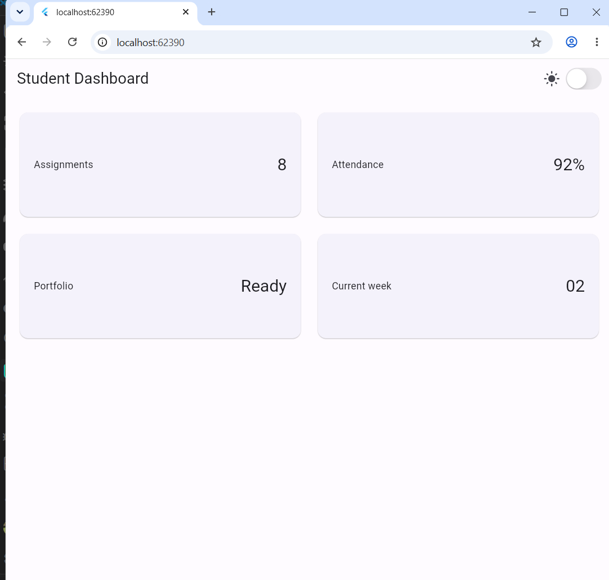
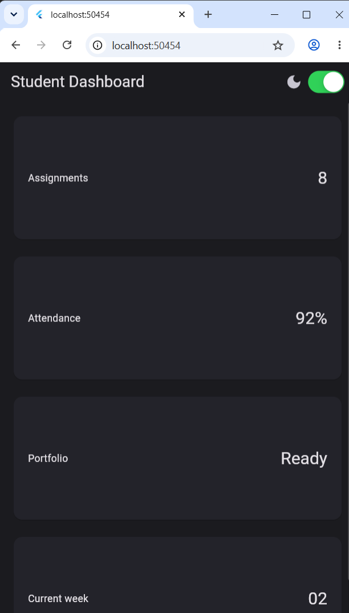
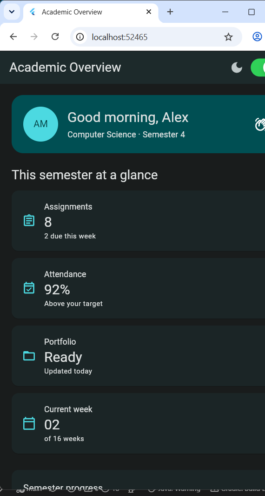
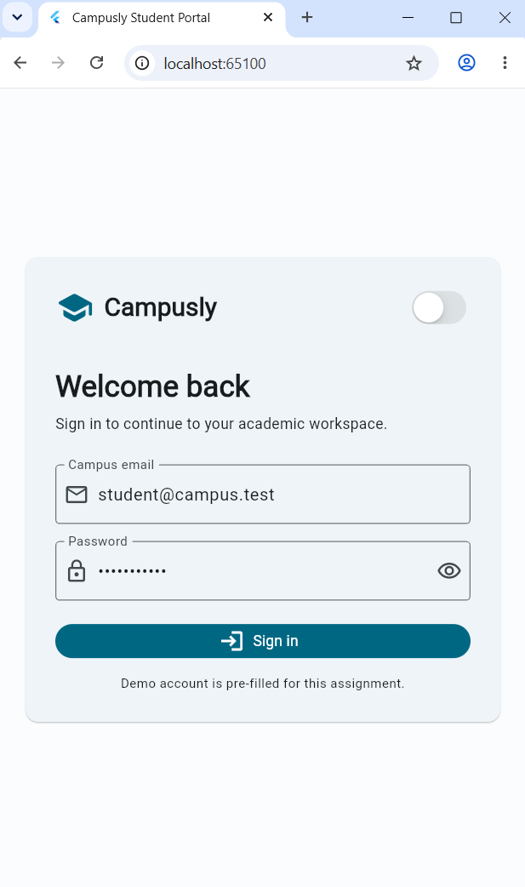
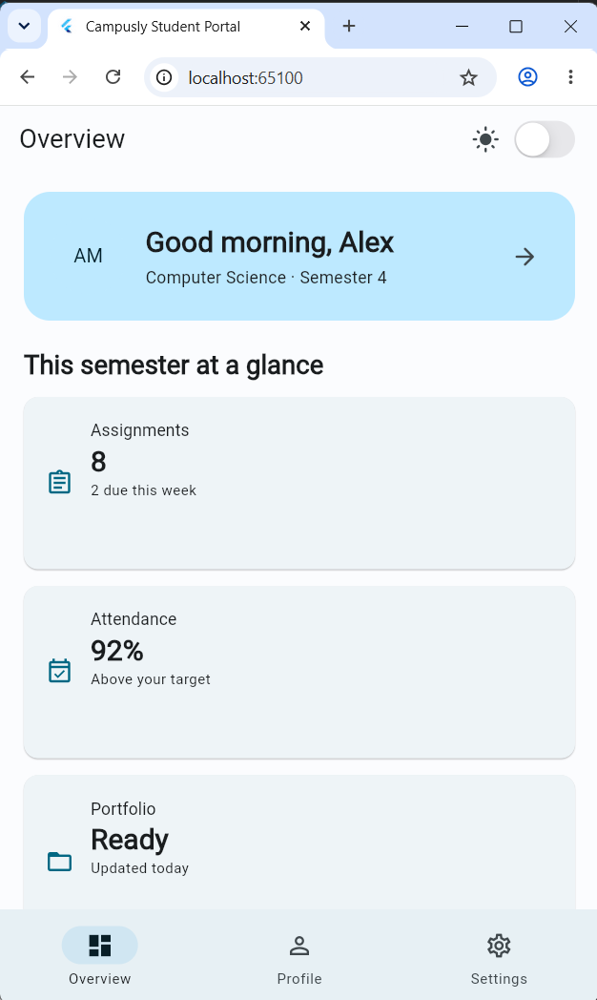
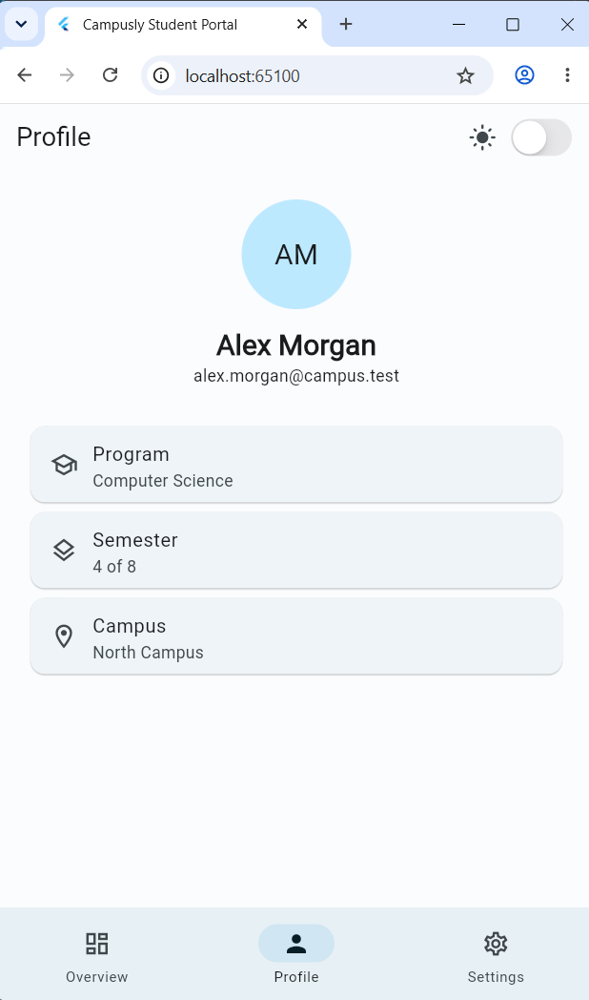
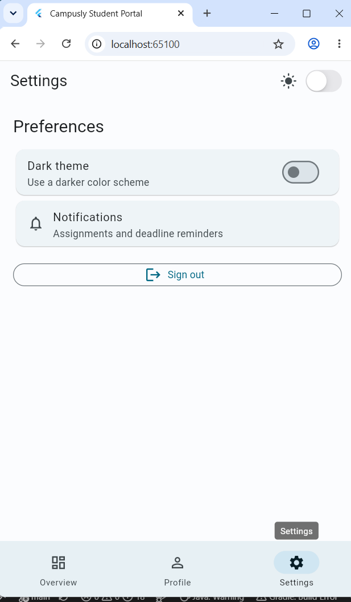

# Week 2 - Declarative UI & Responsive Design

> Dokumentasi praktikum, eksperimen responsive UI, Academic Overview, dan tugas akhir Flutter.

## Identitas

**Nama:** Achmad Daud Roichan  
**NIM:** 244107020005  
**Kelas:** TI 3F  
**Mata Kuliah:** Pemrograman Mobile  
---

## Daftar Isi

- [Ringkasan Pengerjaan](#ringkasan-pengerjaan)
- [Struktur Folder](#struktur-folder)
- [Tahap 1 - Praktikum Awal](#tahap-1---praktikum-awal)
- [Tahap 2 - Eksperimen dan Modifikasi](#tahap-2---eksperimen-dan-modifikasi)
- [Tahap 3 - Academic Overview](#tahap-3---academic-overview)
- [Tahap 4 - Tugas Akhir Campusly](#tahap-4---tugas-akhir-campusly)
- [AI Prompt Challenge](#ai-prompt-challenge)
- [Verifikasi](#verifikasi)
- [Cara Menjalankan](#cara-menjalankan)

---

## Ringkasan Pengerjaan

Week 2 dikerjakan secara bertahap agar perubahan dari aplikasi sederhana sampai aplikasi yang lebih lengkap dapat terlihat jelas:

1. Membuat dashboard dasar menggunakan `GridView`.
2. Menambahkan state dengan `StatefulWidget` dan toggle tema menggunakan `CupertinoSwitch`.
3. Mengembangkan dashboard menjadi halaman **Academic Overview** yang responsive dan accessible.
4. Membuat tugas akhir **Campusly Student Portal** dengan login, dashboard, profile, settings, dark mode, dan navigasi responsive.

---

## Struktur Folder

```text
02-week-2-declarative-ui-responsive-design/
|-- README.md                 <- laporan utama Week 2
|-- prak_week2/               <- praktikum lanjutan: Academic Overview
|   |-- lib/main.dart
|   |-- test/widget_test.dart
|   `-- README.md
|-- tugas_week2/              <- tugas akhir dan AI Prompt Challenge
|   |-- lib/main.dart
|   |-- test/widget_test.dart
|   `-- README.md
`-- screenshoot/              <- bukti visual seluruh tahap
    |-- hasilprak.png
    |-- eksperiment.png
    |-- academic.png
    |-- login.png
    |-- dashboard.png
    |-- profil.png
    `-- settings.png
```

---

## Tahap 1 - Praktikum Awal

Pada tahap awal dibuat dashboard sederhana bernama **Student Dashboard**. Fokus implementasi:

- `MaterialApp` dengan Material 3.
- `Scaffold` dan `AppBar`.
- `LayoutBuilder` untuk membaca ukuran layar.
- `GridView.count` untuk menyusun empat kartu informasi.
- Kartu `Assignments`, `Attendance`, `Portfolio`, dan `Current week`.

### Screenshot hasil praktikum awal



*Tampilan awal menggunakan light theme dengan dua kolom pada layar lebar.*

---

## Tahap 2 - Eksperimen dan Modifikasi

Setelah praktikum awal selesai, aplikasi dimodifikasi untuk mengeksplorasi interaksi dan responsive UI:

- `DashboardApp` diubah menjadi `StatefulWidget`.
- `CupertinoSwitch` ditambahkan ke `AppBar`.
- Tema dapat diubah dari light ke dark secara langsung.
- Breakpoint diuji pada ukuran layar berbeda.
- Layar sempit menggunakan satu kolom.
- Layar lebar menggunakan dua kolom.
- Label aksesibilitas ditambahkan menggunakan `Semantics`.

### Screenshot hasil eksperimen



*Tampilan dark theme dan susunan satu kolom pada layar sempit.*

---

## Tahap 3 - Academic Overview

Implementasi praktikum kemudian dikembangkan menjadi **Academic Overview** di proyek [`prak_week2`](prak_week2/).

### Fitur

- Header profil mahasiswa dengan avatar dan informasi program studi.
- Empat kartu akademik reusable:
  - Assignments
  - Attendance
  - Portfolio
  - Current week
- Semester progress indicator.
- Informasi deadline berikutnya.
- Light theme dan dark theme.
- Toggle tema dengan `CupertinoSwitch`.
- Label aksesibilitas dengan `Semantics`.
- Layout satu kolom pada layar sempit.
- Layout menggunakan `Row` dan `Expanded` pada layar lebar.
- Breakpoint terpusat pada konstanta `kWideBreakpoint`.

### Screenshot Academic Overview



*Tampilan hasil pengembangan dashboard akademik dengan profile header, metric cards, progress, dan deadline.*

Source code dan test tersedia di:

- [`prak_week2/lib/main.dart`](prak_week2/lib/main.dart)
- [`prak_week2/test/widget_test.dart`](prak_week2/test/widget_test.dart)
- [`prak_week2/README.md`](prak_week2/README.md)

---

## Tahap 4 - Tugas Akhir Campusly

Tugas akhir dibuat sebagai aplikasi student portal yang lebih lengkap dengan nama **Campusly Student Portal** di proyek [`tugas_week2`](tugas_week2/).

### Fitur aplikasi

#### 1. Login

- Form email dan password.
- Validasi email.
- Validasi password minimal enam karakter.
- Tombol tampil/sembunyikan password.
- Akun demo sudah terisi otomatis.
- Toggle dark theme pada halaman login.

#### 2. Dashboard / Overview

- Welcome banner untuk Alex Morgan.
- Empat metric cards akademik.
- Semester progress.
- Upcoming deadline.
- Activity panel.
- Tombol shortcut menuju profile.

#### 3. Profile

- Avatar mahasiswa.
- Nama dan email.
- Program studi.
- Semester.
- Lokasi kampus.

#### 4. Settings

- Dark theme toggle.
- Ringkasan pengaturan notifikasi.
- Tombol sign out.

#### 5. Responsive navigation

- `NavigationBar` pada layar sempit.
- `NavigationRail` pada layar lebar.
- Dashboard menggunakan `LayoutBuilder` dan breakpoint responsif.
- Kartu metric berubah dari satu kolom menjadi dua kolom.

### Galeri screenshot tugas akhir

#### Login



Halaman login dengan validasi form, akun demo, password visibility toggle, dan theme switch.

#### Dashboard



Halaman overview dengan welcome banner, metric cards, navigation bar, progress, dan aktivitas akademik.

#### Profile



Halaman profile mahasiswa dengan informasi program, semester, email, dan kampus.

#### Settings



Halaman pengaturan dengan dark theme, notifikasi, dan tombol sign out.

Source code dan test tersedia di:

- [`tugas_week2/lib/main.dart`](tugas_week2/lib/main.dart)
- [`tugas_week2/test/widget_test.dart`](tugas_week2/test/widget_test.dart)
- [`tugas_week2/README.md`](tugas_week2/README.md)

---

## AI Prompt Challenge

### Prompt desain

> Bandingkan dua tata letak dashboard akademik untuk Flutter: versi `GridView` dan versi `LayoutBuilder` + `Column`. Jelaskan trade-off responsif dan aksesibilitasnya.

**Keputusan yang digunakan:** `GridView` dipilih untuk metric cards yang bentuknya seragam karena mudah berubah menjadi satu atau dua kolom. `LayoutBuilder` digunakan untuk membaca constraint aktual. `Column` digunakan sebagai fallback pada layar sempit agar urutan baca tetap natural dan tidak menyebabkan overflow.

### Prompt penguatan konsep

> Jelaskan kapan penggunaan `Expanded` justru menyebabkan overflow di dalam `Row`, beri contoh kode yang gagal dan perbaikannya.

**Kesimpulan:** `Expanded` harus digunakan pada `Row` yang memiliki lebar terbatas. Penggunaan di dalam parent dengan lebar tak terbatas, seperti horizontal scroll, dapat menyebabkan error layout atau overflow. Perbaikannya adalah memberi constraint dengan `SizedBox`/`ConstrainedBox`, menggunakan `Flexible`, atau mengganti `Row` menjadi `Column` pada breakpoint sempit.

Pada implementasi ini, `Expanded` hanya digunakan untuk membagi ruang pada row yang berada di dalam constraint layar atau container yang terukur.

### Verification prompt

> Periksa kembali rekomendasi layout di atas: apakah tetap responsif di bawah 600px, apakah mengurangi aksesibilitas, dan apakah ada widget yang tidak tersedia di Flutter stabil saat ini?

**Hasil verifikasi:**

- Layout sempit diuji menggunakan ukuran viewport `400x800` dan `600x900`.
- Layout lebar diuji menggunakan ukuran viewport `1200x800` dan `1200x900`.
- Informasi penting memiliki label `Semantics`.
- Kontrol icon memiliki tooltip atau label aksesibilitas.
- Widget yang digunakan tersedia pada Flutter stable yang digunakan.
- Tidak ditemukan error analyzer pada source dan test.

---

## Verifikasi

### `prak_week2`

```text
flutter analyze
No issues found!

flutter test
3 tests passed
```

Test mencakup:

- Academic Overview pada layar sempit.
- Academic Overview pada layar lebar.
- Theme switch.
- Label aksesibilitas.

### `tugas_week2`

```text
flutter analyze
No issues found!

flutter test
4 tests passed
```

Test mencakup:

- Login dan perpindahan ke dashboard.
- Empat metric cards.
- NavigationBar pada layar sempit.
- NavigationRail pada layar lebar.
- Navigasi Profile dan Settings.
- Sign out.
- Theme control.

---

## Cara Menjalankan

### Academic Overview

```powershell
cd "02-week-2-declarative-ui-responsive-design\prak_week2"
flutter pub get
flutter run -d chrome
```

### Tugas Akhir Campusly

```powershell
cd "02-week-2-declarative-ui-responsive-design\tugas_week2"
flutter pub get
flutter run -d chrome
```

### Menjalankan test

```powershell
cd "02-week-2-declarative-ui-responsive-design\prak_week2"
flutter analyze
flutter test

cd "..\tugas_week2"
flutter analyze
flutter test
```

> Untuk menjalankan target Windows, Flutter membutuhkan Visual Studio dengan workload **Desktop development with C++**. Chrome tidak membutuhkan toolchain tersebut.

---

## Kesimpulan

Week 2 menunjukkan proses pengembangan bertahap dari dashboard sederhana menjadi aplikasi student portal yang lebih lengkap. Konsep utama yang diterapkan adalah declarative UI, responsive layout, reusable widget, state management sederhana, theme switching, accessibility, dan pengujian widget.
