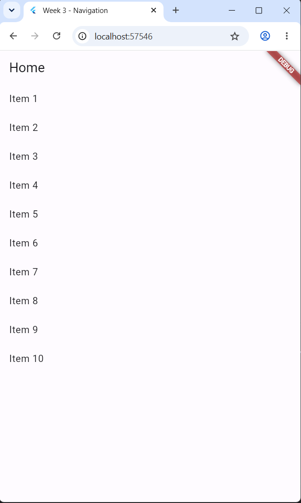
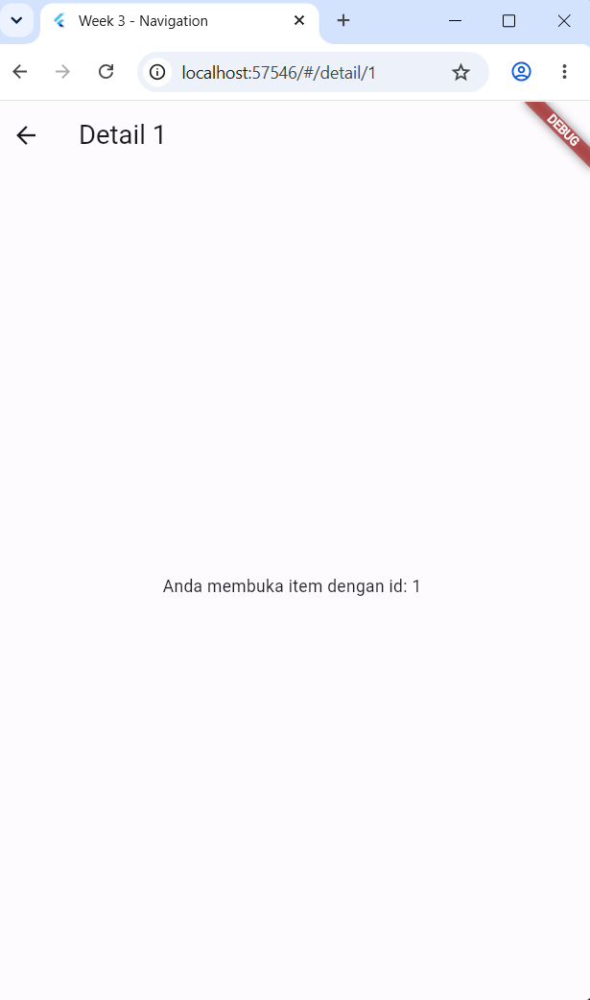
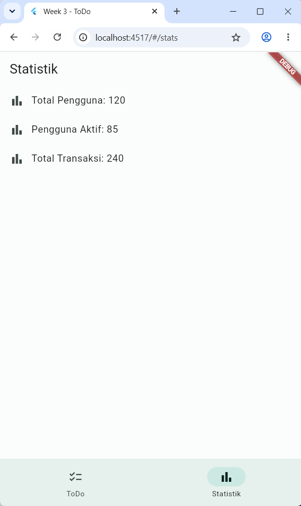
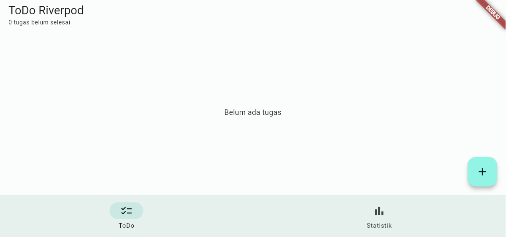

# Praktikum 3 - Navigation dan State Management

Project Flutter ini berisi dua implementasi tugas Week 3. `week3_navigation` membahas navigasi dasar dengan GoRouter, sedangkan `week3_todo` menggabungkan navigasi, Riverpod, dan state asynchronous `AsyncValue`.

## Identitas

| Data | Keterangan |
|---|---|
| Nama | Achmad Daud Roichan |
| NIM | 244107020005 |
| Mata kuliah | Mobile Programming |
| Praktikum | Praktikum 3 - Navigation dan State Management |

## Ringkasan Project

### `week3_navigation` - Navigasi Dasar

- Halaman Home menampilkan 10 item.
- Setiap item membuka detail berdasarkan parameter dinamis, misalnya `/detail/1`.
- Route detail dibuat sebagai child route dari route `/`.
- `context.go('/detail/${index + 1}')` digunakan untuk berpindah ke detail.
- Halaman detail membaca `state.pathParameters['id']` dari GoRouter.

### `week3_todo` - Navigation dan State Management

- Menambah, mencentang, dan menghapus tugas.
- State ToDo dikelola oleh Riverpod `Notifier`.
- Statistik memakai `AsyncNotifier` dan menangani loading, error, serta data.
- NavigationBar menghubungkan daftar ToDo pada `/` dengan statistik pada `/stats`.

## Tujuan

- Membuat aplikasi ToDo dengan state terpusat.
- Memisahkan widget dan logika agar mudah diuji.
- Menerapkan route detail dinamis dan navigasi dua halaman dengan GoRouter.
- Memahami tiga state `AsyncValue` pada proses asynchronous.
- Memverifikasi hasil implementasi dengan analyzer dan widget test.

## Fitur `week3_todo`

- Menambah, mencentang, dan menghapus tugas.
- Provider turunan `incompleteTodoProvider` untuk menghitung tugas yang belum selesai.
- Halaman daftar ToDo pada route `/`.
- Halaman statistik pada route `/stats`.
- NavigationBar untuk berpindah antara daftar dan statistik.
- Statistik asynchronous dengan simulasi loading selama 2 detik.
- Tampilan error dan tombol `Coba lagi` yang menjalankan `ref.invalidate(statsProvider)`.
- Widget test untuk alur menambah tugas.

## Struktur Project

```text
03-week-3-navigation-state-management/
|-- README.md
|-- screenshots/
|-- week3_navigation/
|   |-- lib/
|   |-- test/
|   |-- README.md
|-- week3_todo/
|   |-- lib/
|   |   |-- main.dart
|   |   |-- pages/
|   |   |   |-- todo_page.dart
|   |   |   |-- stats_page.dart
|   |   |-- providers/
|   |   |   |-- todo_provider.dart
|   |   |   |-- stats_provider.dart
|   |   |-- widgets/
|   |       |-- todo_tile.dart
|   |-- test/
|       |-- widget_test.dart
```

## Dokumentasi Screenshot

Screenshot navigasi dasar dari `week3_navigation`:





Screenshot aplikasi ToDo:


<p align="center">
   
</p>

Screenshot tambahan setelah data statistik selesai dimuat:



Screenshot statistik di atas adalah screenshot yang dikirim dari halaman `/stats` dan sudah dimasukkan ke repository. Untuk bukti state error, ambil screenshot `stats-error.png` setelah simulasi error diaktifkan; tampilannya harus memuat pesan error dan tombol `Coba lagi`.

## Stack Teknologi

- Flutter dan Dart
- Riverpod `flutter_riverpod`
- GoRouter `go_router`
- Material 3
- Flutter Test

## Cara Menjalankan

```powershell
cd week3_navigation
flutter pub get
flutter run
```

Untuk menjalankan aplikasi ToDo:

```powershell
cd week3_todo
flutter pub get
flutter run
```

## Uji Tiga State

1. Jalankan aplikasi, buka halaman `Statistik`, dan amati indikator loading selama sekitar 2 detik.
2. Untuk menguji error secara deterministik, buka `week3_todo/lib/providers/stats_provider.dart` dan ubah sementara isi `build()` setelah `Future.delayed` menjadi:

   ```dart
   throw Exception('Gagal terhubung ke server');
   ```

3. Jalankan ulang aplikasi. Halaman statistik harus menampilkan pesan error dan tombol `Coba lagi`.
4. Tekan `Coba lagi`. Pemanggilan `ref.invalidate(statsProvider)` menjalankan provider kembali.
5. Hapus kembali baris `throw`, jalankan aplikasi, dan pastikan data statistik tampil.

Kode saat ini sudah dikembalikan ke perilaku normal. Provider statistik juga memiliki peluang error acak 30% untuk membantu mengamati state error tanpa mengubah kode.

## Hasil Cross-check AI

| Pemeriksaan | Hasil | Temuan |
|---|---|---|
| State immutable | Lulus | Penambahan memakai list spread, toggle membuat salinan list dan `Todo.copyWith`, penghapusan membuat list baru. Tidak ada `state.add()` atau mutasi state langsung. |
| `ref.watch` dan `ref.read` | Lulus | `ref.watch` dipakai di `build()` pada halaman/provider turunan. `ref.read` dipakai pada callback tambah, toggle, dan hapus. |
| Tiga state `AsyncValue` | Lulus | `StatsPage` menangani `loading`, `error`, dan `data` melalui `.when(...)`. |
| Tipe provider eksplisit | Lulus | `NotifierProvider<TodoListNotifier, List<Todo>>`, `Provider<List<Todo>>`, dan `AsyncNotifierProvider<StatsNotifier, List<String>>` dideklarasikan eksplisit. Tidak ada provider duplikat untuk state yang sama. |
| API Riverpod lama | Lulus | Kode menggunakan `Notifier`, `AsyncNotifier`, `ConsumerWidget`, dan `ProviderScope`; tidak menggunakan `StateProvider` atau `StateNotifierProvider` usang. |
| Pemisahan `TodoTile` | Lulus | Widget baris ToDo berada di `lib/widgets/todo_tile.dart`. |
| Filter turunan | Lulus | `incompleteTodoProvider` membaca `todoListProvider` dan menghasilkan daftar tugas belum selesai. Hasilnya dipakai sebagai jumlah tugas pada AppBar. |
| GoRouter | Lulus | Route `/` dan `/stats` tersedia, dengan `NavigationBar` untuk perpindahan halaman. |
| ProviderScope root | Lulus | `main()` membungkus `MyApp` dengan `const ProviderScope`. |
| Test | Lulus | Test menambah tugas menggunakan `ProviderScope`, dialog, input, dan tombol `Tambah`. |

### Catatan batasan

- Project memiliki route utama `/` dan route statistik `/`; belum ada route detail tugas terpisah. Akses langsung ke `/stats` didukung oleh GoRouter.
- `context.go` dipakai untuk perpindahan top-level karena mengganti lokasi halaman. `context.push` belum diperlukan karena belum ada halaman detail yang perlu ditumpuk di atas halaman sebelumnya.
- Provider statistik saat refresh menampilkan state loading baru. Untuk aplikasi produksi, data lama dapat dipertahankan sambil menampilkan indikator refresh agar layar tidak berkedip atau kosong.
- `ProductPage` dan `productsProvider` adalah contoh tambahan yang tidak didaftarkan pada router utama.

## Refleksi

### Mengapa stale data dengan indikator refresh bisa lebih baik?

Mengosongkan layar ketika refresh membuat pengguna kehilangan konteks dan terlihat seperti aplikasi belum memiliki data. Menampilkan data lama sambil memberi indikator refresh mempertahankan konteks, membuat UI terasa lebih cepat, dan mengurangi kedipan layar.

Pola ini penting untuk dashboard, daftar transaksi, inbox, monitoring, dan halaman yang sering diperbarui ketika data lama masih berguna. Data lama harus diberi penanda bahwa sedang diperbarui dan tidak boleh dianggap sebagai hasil terbaru sampai request selesai.

### Kapan `setState` masih cukup?

`setState` cukup untuk state lokal dan sederhana, misalnya membuka dialog, mengubah pilihan tab pada satu widget, atau mengatur animasi. Riverpod lebih tepat ketika state dipakai beberapa halaman/widget, perlu diuji tanpa bergantung pada context, atau berasal dari proses asynchronous.

### Perbedaan `context.go` dan `context.push`

`context.go('/stats')` mengubah lokasi tujuan utama dan cocok untuk NavigationBar. `context.push('/detail')` menambahkan halaman baru ke stack sehingga tombol back kembali ke halaman sebelumnya. Karena project ini belum memiliki halaman detail, `context.go` sudah sesuai untuk dua route top-level yang tersedia.

### Mengapa `AsyncValue` lebih aman daripada tiga boolean?

`AsyncValue` menyatukan data, loading, dan error dalam satu state yang saling konsisten. Tiga boolean terpisah dapat menghasilkan kombinasi tidak valid, misalnya `isLoading == true` sekaligus `hasError == true` tanpa aturan yang jelas. Pola `AsyncValue.when` memaksa UI menangani seluruh keadaan yang relevan.

### Perbaikan terhadap hasil AI

Perbaikan yang dilakukan setelah cross-check:

- Menghapus parameter `retry` pada `ProviderScope` karena tidak tersedia pada versi Riverpod project ini.
- Mengganti test bawaan counter yang tidak sesuai aplikasi dan tidak memakai `ProviderScope`.
- Menambahkan `incompleteTodoProvider` dengan transformasi list immutable.
- Menyesuaikan tampilan jumlah tugas dengan API `AppBar` yang tersedia pada Flutter SDK lokal.
- Menambahkan `pumpAndSettle()` pada test agar animasi dialog selesai sebelum assertion.

## Verifikasi

Verifikasi `week3_todo` dijalankan dari folder project tersebut:

```powershell
flutter analyze
flutter test
```

Hasil terakhir:

```text
flutter analyze: No issues found!
flutter test: All tests passed!
```

`week3_navigation` sudah dimasukkan ke commit bersama source, test, README, dan konfigurasi project. Verifikasi ulang project ini sempat terhenti karena ruang disk Windows penuh saat Flutter menulis file sementara, bukan karena laporan error Dart.

## Referensi

- [Slide Navigation & State Management](https://jti-polinema.github.io/flutter-codelab/00-slides/Week_03_Navigation_State_Management.html)
- [Flutter Navigation](https://docs.flutter.dev/ui/navigation)
- [GoRouter](https://pub.dev/packages/go_router)
- [Riverpod Getting Started](https://riverpod.dev/docs/introduction/getting_started)
- [Riverpod AsyncNotifier dan AsyncValue](https://riverpod.dev/docs/concepts/async_notifiers)
- [Learn Dart in Y Minutes](https://learnxinyminutes.com/docs/dart/)
